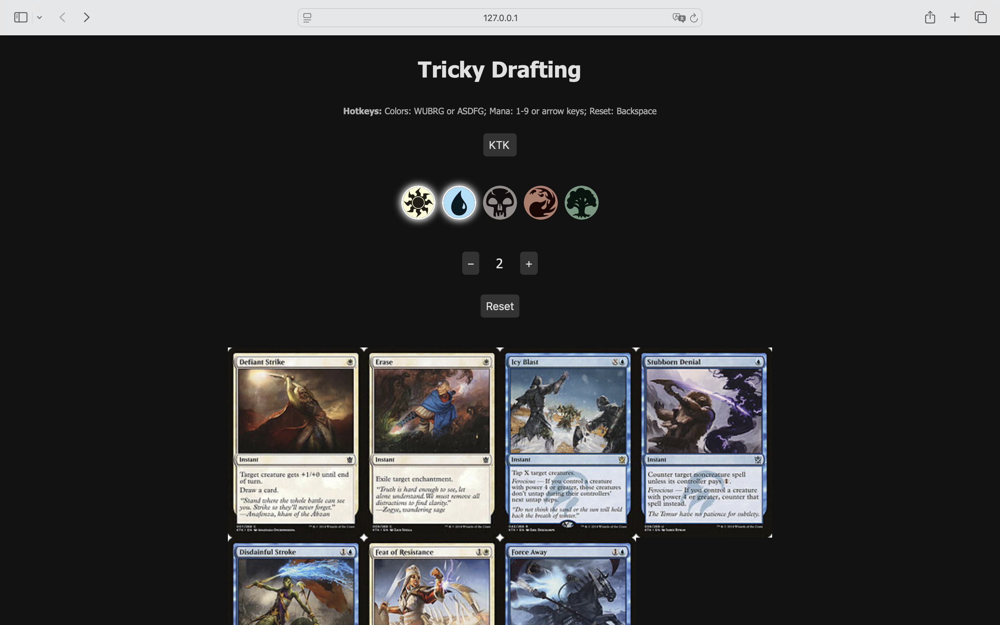

# Tricky Drafting

The idea behind the repository is to help _Magic: The Gathering_ players to quickly identify all possible cards ("tricks")
which can be played in a game of limited, e.g., draft, by an opponent based on the number of open mana and colors to which they have access.

The code provides a fast web interface to query the Scryfall API for instants or cards with flash fitting the mana / color
requirements.



## Quickstart

To set up the repository, follow these steps:

0. Make sure you have [Python](https://www.python.org) installed on your machine (the code has been tested for Python 3.9 but the requirements can be adjusted to fit the user's needs)
1. Optional: Create a Python virtual environment
2. Start by cloning it and installing the requirements
    ```bash
    git clone https://github.com/KainAber/tricky-drafting.git
    pip install -r requirements.txt
    ```
3. Launch the application
    ```bash
    /path/to/python /path/to/repo/app.py
    ```
Now you are ready to use the app! 

Start by adjusting the set code if needed (the default code should be the one of the latest Standard-legal expansion)
and configure the UI to fit the game state.

To have quick access to the application, an alias can be added to your shell which executes the launch command above.

## Known Limitations

- Activated abilities from the hand (cycling, channel, etc)
- Alternate casting costs
- Cost reductions
- Abilities of face-down permanents

## Acknowledgements

- This project utilizes data from the Scryfall API